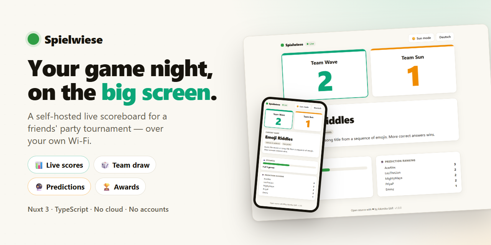
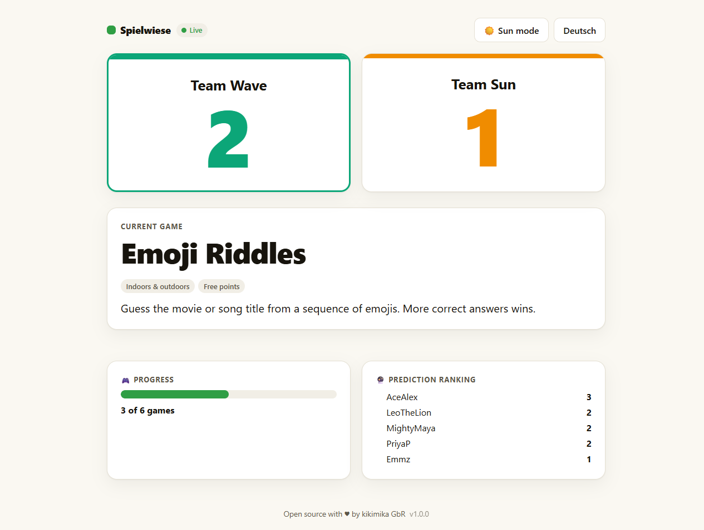
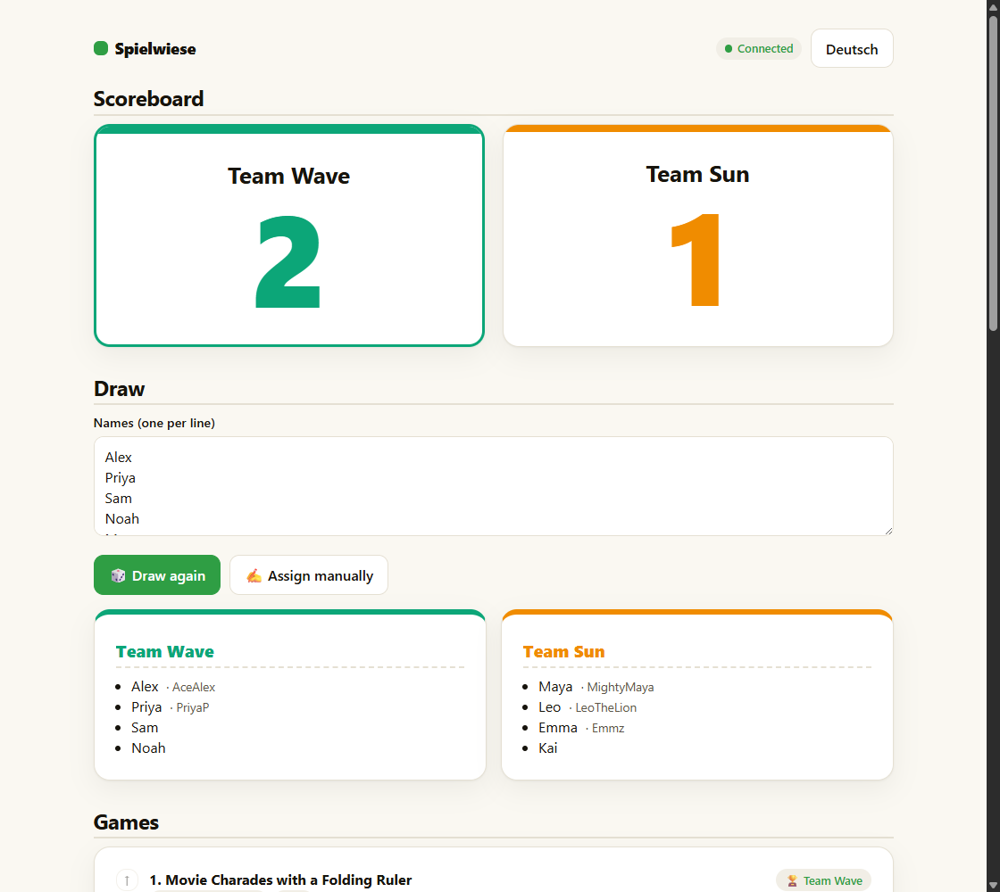
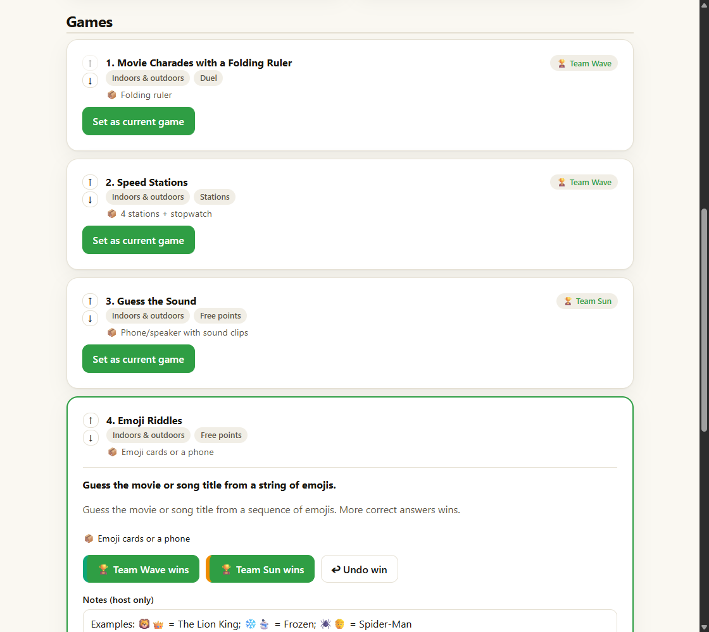
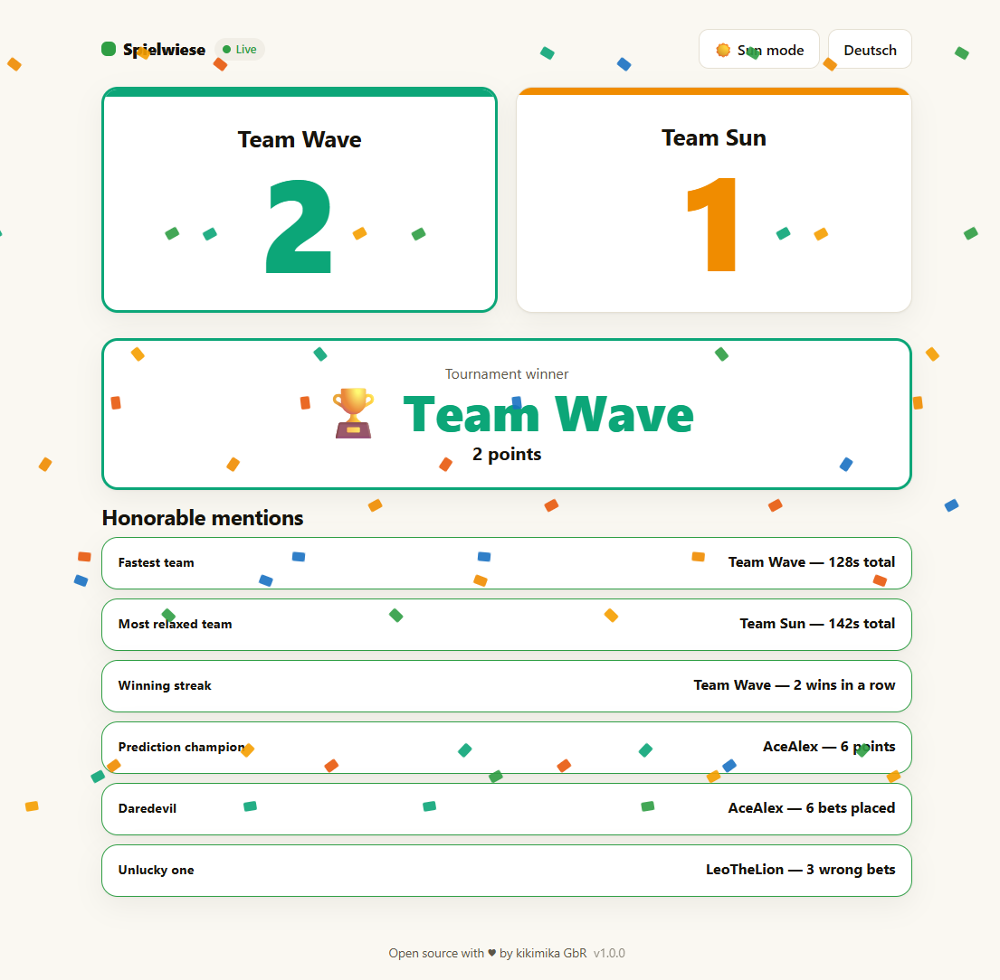
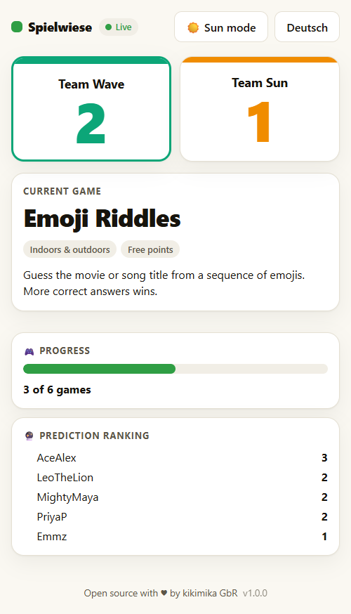
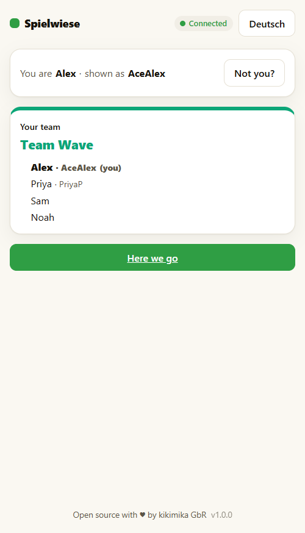
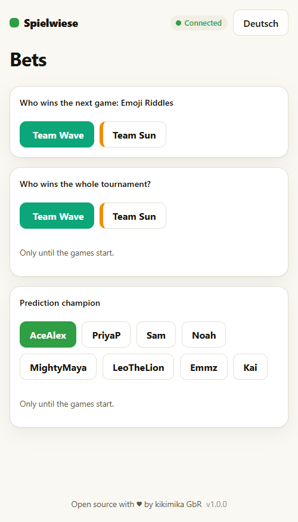
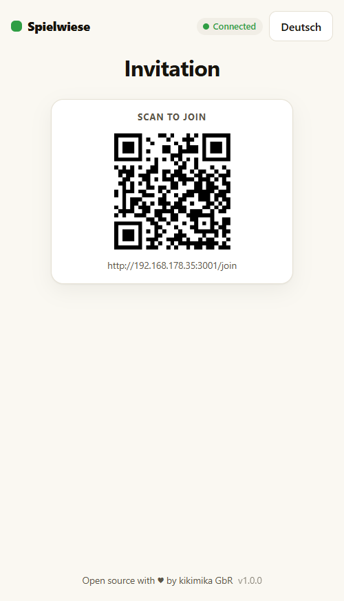

<p align="center">
  
</p>

# 🌱 Spielwiese

**A self-hosted live scoreboard for a friends' game-night tournament.** Draw
teams, show the current game and its rules, track the score live on every phone
(and a TV), let guests predict the winners, and finish with an awards screen
before the big reveal. All running on your own machine over the local Wi-Fi.
**No internet, no accounts, no cloud.**

Built for a 5-vs-5 garden tournament, but everything is editable, so it works
for any point-based party tournament.

> ☕ **Enjoying Spielwiese?** [Buy us a coffee](https://ko-fi.com/I4N620AYLT) Thank you!

> Scoring is deliberately simple: **one point per game won.** The host just taps
> which team won each game. Anything that happens _inside_ a game (running
> tallies, times) can be jotted in the game's note field for the host's
> overview — it never touches the tournament score.

## Screenshots

The live **Board** — the shared big screen everyone watches, with the current
game, the running score and the guests' prediction ranking:



The **Host** control panel — draw the teams, run the games and award the points,
all from your own phone:



Managing the games: reorder the lineup, mark past winners and pick the current
game — one tap on the winning team scores it (and it's fully undoable):



At the end, the **awards ceremony**: the host reveals each honorable mention one
by one, then crowns the tournament winner with confetti:



Everything is responsive: guests join, predict and follow along on their phones,
and the board reflows to fit a small screen too.

<table>
  <tr>
    <td align="center" width="25%"><br><sub><b>Board</b> on a phone</sub></td>
    <td align="center" width="25%"><br><sub><b>Join</b> — your team</sub></td>
    <td align="center" width="25%"><br><sub><b>Bets</b> — predict winners</sub></td>
    <td align="center" width="25%"><br><sub><b>Invite</b> — scan to join</sub></td>
  </tr>
</table>

## Features

- **Live scoreboard** pushed to every device over WebSocket — no reloads.
- **One responsive board** that works on a phone in bright sunlight and
  full-screen on a TV, with a **sun mode** for extra contrast, a few **colour
  themes** (default / dark / neon) and **optional sound cues** (a chime on each
  win, a fanfare for the ceremony — synthesised in the browser, no audio files).
- **Team draw** — random (with a suspense animation) or assign players by hand;
  a soft **reset** keeps your games and names for a rerun, and you can
  **save & resume** a running tournament under a name.
- **Game library on its own page** — build your own games in **seven game
  types** (see below), tick which ones are in this tournament, filter by type,
  location or preset pack, and optionally track a time/distance. **Ready-made
  bilingual game packs** and a set of example games ship as editable seed data.
- **Simple scoring** — one point per win, one tap, fully undoable.
- **Predictions** — guests bet on the current game's winner, the tournament
  winner, and who becomes the prediction champion; a live ranking keeps score.
- **Awards / honorable mentions** — fastest team by measured time, longest
  winning streak, and playful guest awards (prediction champion, biggest
  daredevil, unluckiest bettor); nothing that just re-ranks teams by points,
  since that _is_ the winner. The host **reveals each one on the board at their
  own pace** before the winner ceremony (confetti, or a proper "It's a draw!"
  if the teams tie), followed by an **end-of-event recap** — each team's points
  progression, the lead changes and the biggest lead of the tournament.
- **Spectator mode** — a read-only `/watch` view for people who aren't playing;
  a guest who's also watching sees their own live prediction score, and a
  **shareable result card** appears once the tournament finishes.
- **Pause modes** — a short break, or a pre-ceremony pause that hides the
  scores to build suspense.
- **Reconnect handling** — drop Wi-Fi mid-event and every view shows a clear
  reconnect banner with a manual retry, on top of the automatic reconnect.
- **Bilingual UI** (German / English) with a toggle.

### Game types

Every game is scored the same way (one tap for the winning team); the type only
changes what the board shows and how the host reveals it. A game can be a plain
**free game** run by hand, or one of seven guided types:

| Type                | On the board                                                        |
| ------------------- | ------------------------------------------------------------------- |
| **Quiz**            | Question/answer pairs, stepped through and revealed one at a time   |
| **Estimate**        | One prompt with a solution (and optional unit), revealed on cue     |
| **Multiple choice** | Lettered options; the correct one is highlighted on reveal          |
| **Ordering**        | Items shown in a neutral order, then the correct sequence           |
| **True / false**    | A statement, revealed as true or false                              |
| **Matching**        | Terms with a pooled bag of answers, then the correct pairs          |
| **Buzzer**          | A quick-fire question; teams buzz in, the answer is revealed on cue |

Several of them also ship as **bilingual presets** in the ready-made packs.

## The views

| View       | Path      | For                                                    |
| ---------- | --------- | ------------------------------------------------------ |
| **Board**  | `/board`  | The big screen / everyone's phone — live scores & game |
| **Host**   | `/host`   | You (PIN-protected) — draw, run games, award points    |
| **Join**   | `/join`   | Guests — identify by name, see their team              |
| **Bets**   | `/bets`   | Guests — predict winners                               |
| **Watch**  | `/watch`  | Spectators — a read-only live view, no controls        |
| **Invite** | `/invite` | QR codes that send guests to `/join` or `/watch`       |

## Roadmap

What's here, planned and on the idea list lives in [ROADMAP.md](ROADMAP.md).

## Requirements

- Node.js `>= 20`
- pnpm (via `corepack enable`)

## Quick start

```bash
corepack enable
pnpm install

# Production (recommended for the event):
pnpm build
pnpm serve   # runs the built server and auto-restarts it if it ever crashes
```

The server listens on **all network interfaces automatically**, so it's reachable
at your machine's Wi-Fi address with no configuration. On startup it prints the
exact URLs, for example:

```
  🌱 Spielwiese is running — open these on the same Wi-Fi:
     Board:   http://192.168.178.35:3000/board
     Host:    http://192.168.178.35:3000/host
     Join:    http://192.168.178.35:3000/join
     Invite:  http://192.168.178.35:3000/invite
```

Open the **Board** URL on the TV (or any phone), share the **Invite** page so
guests scan the QR code, and keep **Host** on your own phone. That's it — no IP
or `.env` setup needed to be reachable on the LAN.

To use a different port: `PORT=3100 pnpm serve`.

For development with hot reload: `pnpm dev` (also binds all interfaces and prints
the same URLs).

### Host PIN

The host area is gated by a PIN, set via `NUXT_HOST_PIN` (see `.env.example`);
it defaults to `1909`. **Change it before the event.**

### Windows firewall

The first time you start the server, Windows may ask whether to allow Node.js
through the firewall — **allow it on the private network**, otherwise other
devices can't reach the board.

## Running the event

1. **Host → Draw**: paste the guest names (one per line) and draw the teams.
2. **Host → Games**: tick the games you want, set one as the current game.
3. **Invite**: guests scan the QR and open `/join` to identify themselves.
4. **Bets**: guests predict winners (locks once the games start).
5. **Host**: tap the winning team of each game (+1 point), jot notes/times.
6. **Host → Control**: pause when needed; "Show awards" puts the honorable
   mentions on the board with their winners still hidden.
7. **Host → Reveal awards**: uncover each mention one by one, then "Start
   ceremony" flips the board to the tournament winner.

## Resilience

Guests can close the tab, lock their phone or lose Wi-Fi — when they come back,
the client reconnects automatically and the server pushes the full current
state. The one machine that must stay up is the **host machine running the
server**; its state is persisted to `data/state.json`, so even a crash or
restart recovers everything — and `pnpm serve` relaunches it automatically if it
ever exits. Disable sleep on it for the duration of the party.

## Tech stack

Nuxt 3 · Vue 3 · TypeScript · Nitro (server routes + WebSocket) ·
`@nuxtjs/i18n` · Vitest · ESLint · Prettier. State lives in memory and is
persisted to a JSON file — small and robust enough for a one-day event.

## Scripts

```bash
pnpm dev         # dev server (binds all interfaces, prints URLs)
pnpm build       # production build
pnpm serve       # run the build with auto-restart (recommended for the event)
pnpm start       # run the build once (no auto-restart)
pnpm typecheck   # vue-tsc
pnpm lint        # eslint (zero warnings allowed)
pnpm format      # prettier --write
pnpm test:run    # vitest (once)
pnpm check       # format check + lint + typecheck + tests
```

## Data & privacy

All data lives on the host machine only. Live state is written to
`data/state.json`, which is git-ignored — real guest names and scores never end
up in the repository. Delete the file (or use **Reset** in the host view) to
start fresh.

## Contributing

Issues and PRs are welcome. Please keep the checks green (`pnpm check`): the UI
is fully internationalised (add every key to both `de.json` and `en.json`), and
pure logic lives in `core/` with unit tests.

## License

MIT © kikimika GbR
